# Enable UART-WiFi Bridge

> "Wireless Made Easy!" - This example application enable a Transparent UART Bridge over Wi-Fi based on TCP/IP Client/Server

Devices: **WFI32E01**

<!--

**Watch the video and see how to enable L2 Bridging function with WFI32E Curiosity board**

-->

## ⚠ Disclaimer

<b>
THE SOFTWARE ARE PROVIDED "AS IS" AND GIVE A PATH FOR SELF-SUPPORT AND SELF-MAINTENANCE.  
This repository contains unsupported example code intended to help accelerate client product development. It is not validated for production nor audited for security best-practices.  
Note that while this repository is unsupported, Microchip welcome community contributions, and all pull-requests will be considered for inclusion into the repository.

</b>

> Interact with peers in the community at [WiFi Forum](https://www.microchip.com/forums/f545.aspx).

## Description

This Transparent Wi-Fi (TCP) to UART Bridge supports both AP and Station Wi-Fi modes. The main purpose of this code example is to serve as a serial bridge: bridge a TCP connection over Wi-Fi to serial interface. Thus, it allows the WFI32E device to become a totally transparent Wi-Fi to Serial bridge. The UART-to-WiFi-TCP bridge transmits all incoming TCP bytes on a socket out of the WFI32E's UART module and all incoming UART bytes out of a TCP socket.

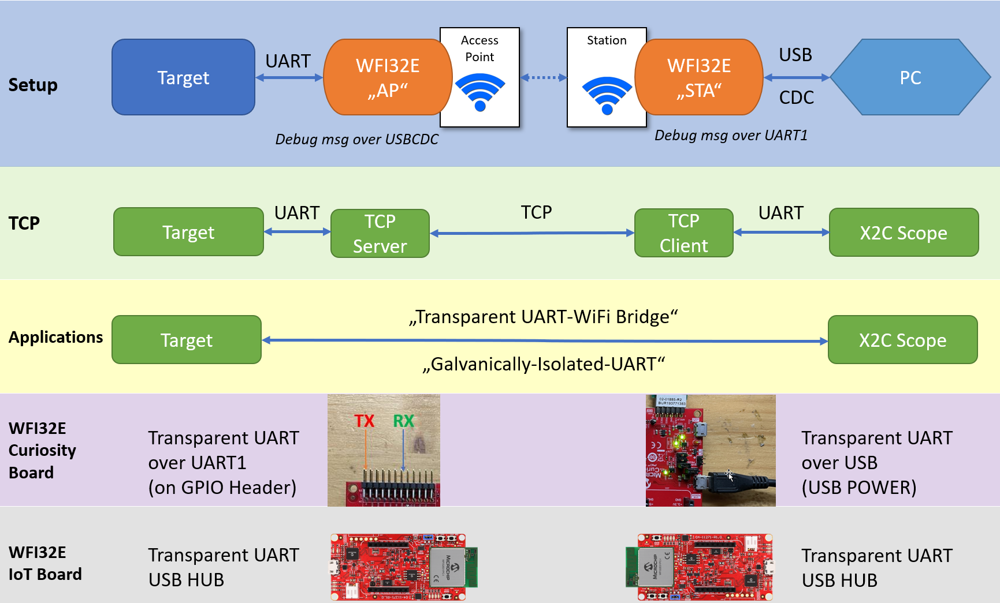

A TCP Server is running on the WFI32E AP Device. Its job is to listen for incoming connections at a port (47111) on the device's IP address. When a remote device (TCP Client) reaches out, the TCP Server creates a channel for the WFI32E Server and the remote client to communicate. The typical UART rates are 115 200 baud. So theorically, the time push up to 1400 Bytes (the maximum TCP packet size) out is around 130 milliseconds.

In this demo, the WFI32E is operating in AP mode and run the TCP Server. The Station device which run the TCP Client program can be a second WFI32E device or a Computer with Wi-Fi adapter or a Smartphone.

The bridge can be useseful in many applications such as Motor control, maintenance, Field bus, etc...

- In Motor control applications, the Transparent UART-WiFi Bridge can provide a galvanic isolation between the target (generally the motor control part) and a real-time debugging tool such as [MPLAB(r) Harmony X2C Scope](https://microchip-mplab-harmony.github.io/x2c/x2c-scope/docs/readme.html) which allow to "watch" or "plot" any global variable in an embedded application at run-time i.e. without halting the CPU. So very useful for motor control development.

- With a serial bootloader and a WFI32E device in Wi-Fi serial bridge, it is possible to reflash the microcontroller "wirelessly" and then use telnet to interact with and debug the system remotely

- This application also can make field-bus RS485-WiFi bridge with a RS485 transceiver implementing automatic direction control connected to the UART interface. That enable to build a "long" RS485 transmission line and debug it wirelessly or make simple extension without adding additional wires for a new sensor on the bus

## Software requirement

The sample project has been created and tested with the following Software Development Tools:
- [MPLAB X IDE v6.00](https://www.microchip.com/en-us/tools-resources/develop/mplab-x-ide)
- [MPLAB XC32 v3.01](https://www.microchip.com/en-us/tools-resources/develop/mplab-xc-compilers)
- MPLAB Harmony v3.6.4
   - mhc v3.8.2
   - csp v3.10.0
   - core v3.10.0
   - wireless_wifi v3.6.1
   - dev_packs v3.10.0
   - wireless_system_pic32mzw1_wfi32e01 v3.6.1
   - wolfssl v4.7.0
   - net v3.7.4
   - crypto v3.7.5
   - CMSIS-FreeRTOS v10.3.1

Download and install a serial terminal program like [TeraTerm](https://osdn.net/projects/ttssh2/releases/). Launch TeraTerm program and configure the serial ports mounted with: **115200 bps, 8 N 1**

## Hardware setup using the WFI32 Curiosity Board

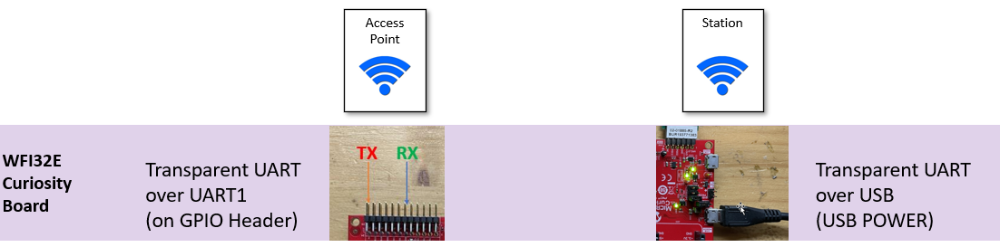

### WFI32E AP Device

- J202 = VBUS
- J301 = open
- Computer connected to [WFI32 Curiositiy board](https://www.microchip.com/DevelopmentTools/ProductDetails/PartNO/EV12F11A) over USB POWER (J204) to power the board and observe the console logs
- USB-to-UART cable between the computer and GPIO Header UART1 pins (Rx, GND, Tx) for the Transparent UART bridge

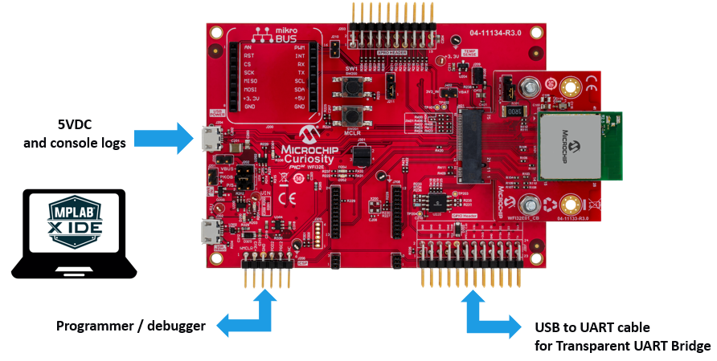

### WFI32E Station Device

- J202 = VBUS
- J301 = open
- Computer connected to [WFI32 Curiositiy board](https://www.microchip.com/DevelopmentTools/ProductDetails/PartNO/EV12F11A) over USB POWER (J204) to power the board and for the Transparent UART bridge
- USB-to-UART cable between the computer and GPIO Header UART1 pins (Rx, GND, Tx) to observe the console logs

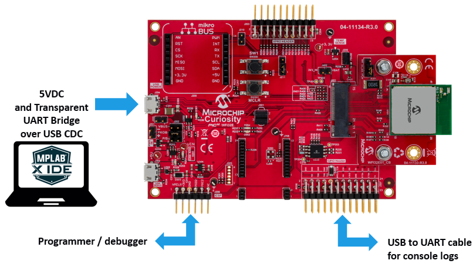

## Hardware setup using the WFI32 IoT Board

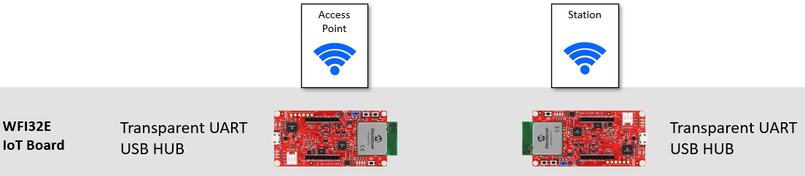

- Computer connected to [WFI32 IoT board](https://www.microchip.com/DevelopmentTools/ProductDetails/PartNO/EV36W50A) over USB (J200) to power the board and act as a USB Hub to debug/program the board, observe the console logs over a USB CDC and interact with the Transparent UART bridge over USB CDC

## LED indicators

The on-board LEDs provides a visual indication on the application status.

| LED Status | Description |
| ---------- | ----------- |
| RED LED Blinking | In Wi-Fi connection process |
| RED LED On/solid | Wi-Fi station is connected to Wi-Fi AP |
| GREEN LED Blinking | In TCP connection process, wait for UART message from the station |
| GREEN LED On/solid | TCP UART Bridge established |
| RED LED Flickering | Data send to TCP (Wi-Fi) |
| GREEN LED Flickering | Data send to UART (CDC) |

## Try it using two WFI32E boards

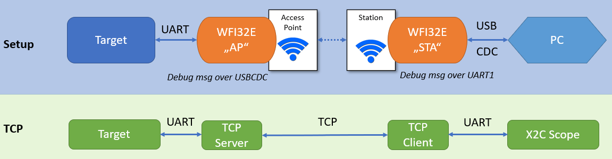

1. Clone/download the repo
2. Open the `uartbridge_ap` project with MPLAB X IDE
3. Build and program the code in the SoftAP board
4. Open the `uartbridge_sta` project with MPLAB X IDE
5. Build and program the code in the Station board
6. Reset both boards
7. Wait until the Transparent UART to Wi-Fi is established, observe the Red LED flash until the WLAN connection is established
8. The Red LED become solid and the Green LED indicates that a TCP Client/Server connection has been established and data can be transported

8. Exchange data from the console: type characters, send file

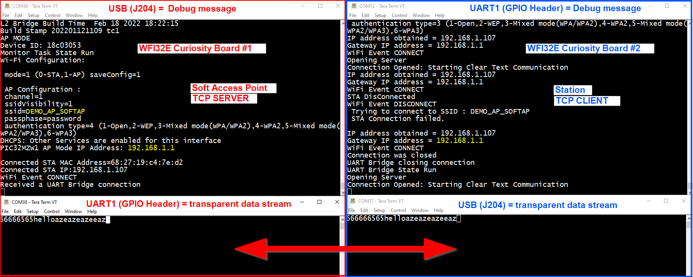

9. Observe the LEDs. If data is sent in the direction of TCP (Wi-Fi), the Red LED flickers. At rest, the Red LED stays On. If data is sent in the direction of the UART (or USB CDC), the Green LED flickers. At rest, the Green LED stays On. If the Green LED starts flashing on a regular basis, the TCP connection has been interrupted. If the Red LED starts flashing on a regular basis, then the Wi-Fi connection has been interrupted. For the two last cases, the recommendation is to restart the firmware on both boards with the Reset/MCLR buttons.

## Try it using one WFI32E board and a Computer

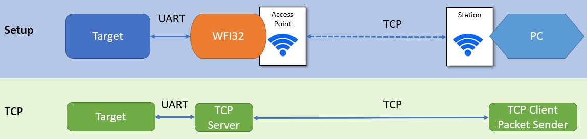

1. Clone/download the repo
2. Open the `uartbridge_ap` project with MPLAB X IDE
3. Build and program the code in the SoftAP board
4. Using your computer with WLAN adapter as a Wi-Fi Station, connect to DEMO_AP_SOFTAP (pwd: password)

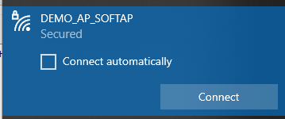

5. Use the tool [Packet Sender](https://packetsender.com/download) to connect to 192.168.1.1 and send/receive TCP packets on the port 47111
6. Send a file from the TCP server and observe the data received on [Packet Sender](https://packetsender.com/download)

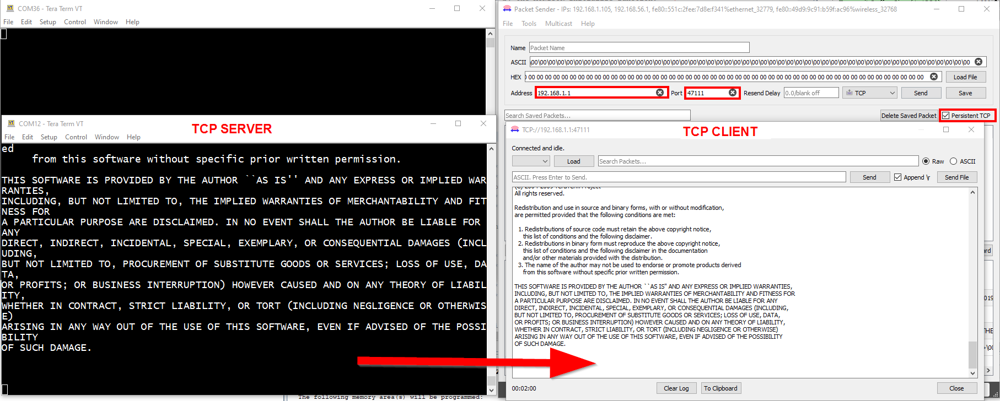

7. Send a file from the TCP client and observe the data received on the TCP server console (WFI32E).

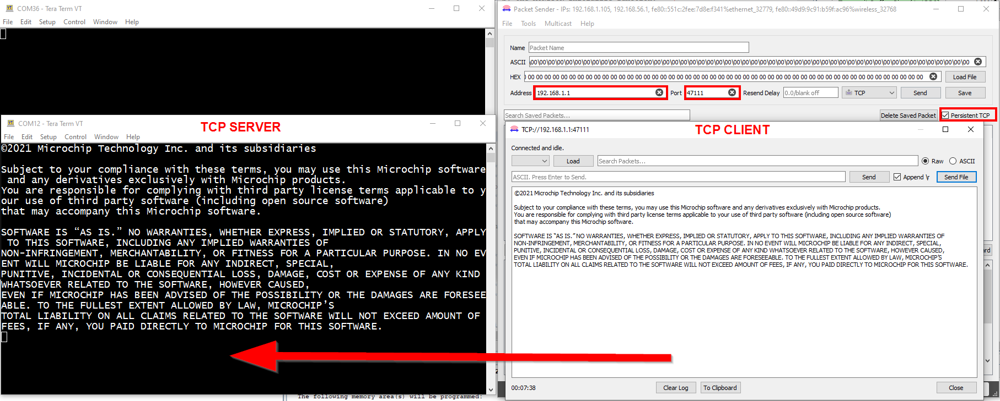

## Try it using one WFI32E board and a Smartphone

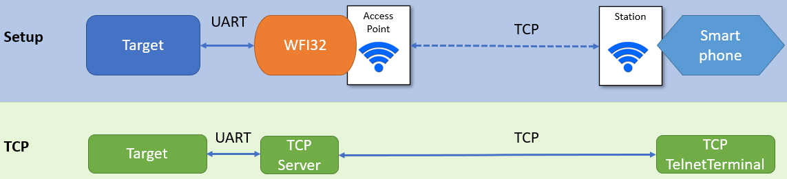

1. Clone/download the repo
2. Open the `uartbridge_ap` project with MPLAB X IDE
3. Build and program the code in the SoftAP board
4. Using your smartphone as a Wi-Fi Station, connect to DEMO_AP_SOFTAP (pwd: password)
5. Use the Smartphone App called **TCP Telnet Terminal** ([Google Play](https://play.google.com/store/apps/details?id=project.telnettcpterminal&hl=fr&gl=US), [App Store](https://apps.apple.com/fr/app/tcp-telnet-terminal/id1387816355)) to connect to 192.168.1.1 and send/receive TCP packets on the port 47111

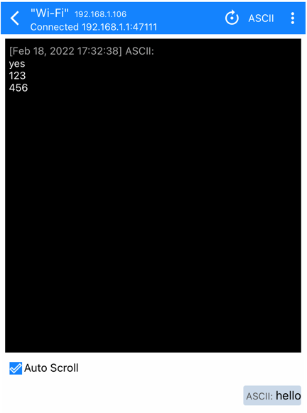

6. Send simple text message on both directions

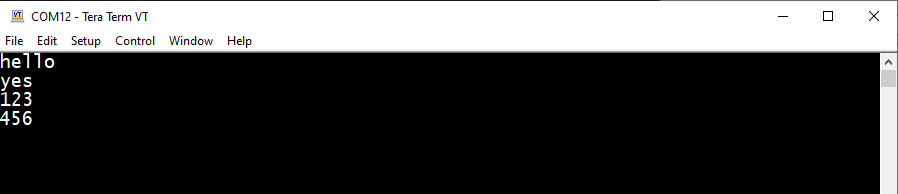

